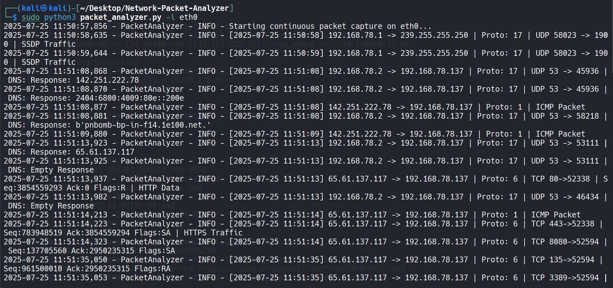
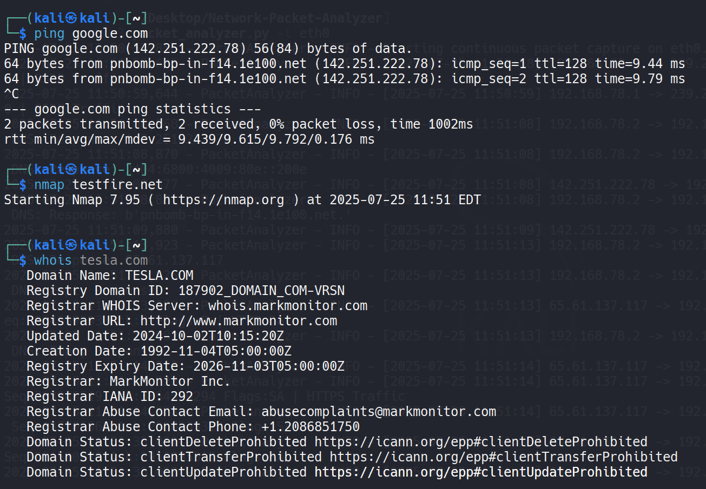
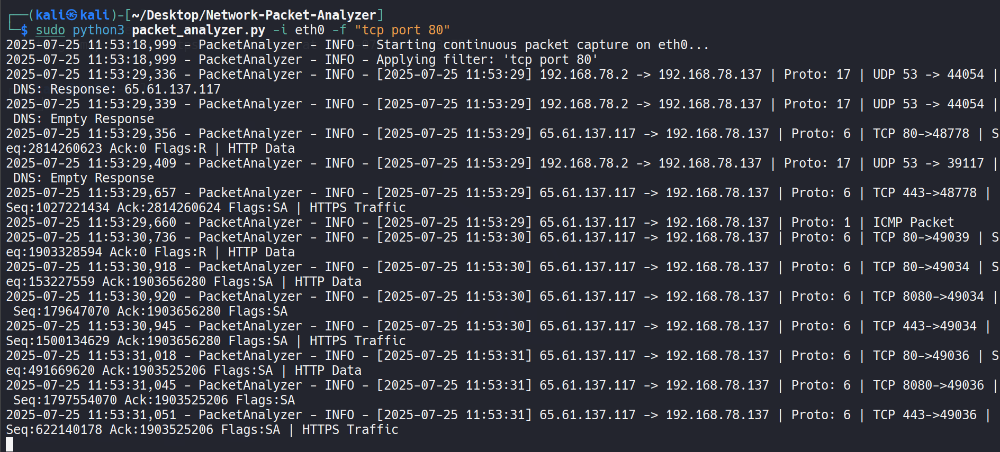

# 🛡️ Python-Based Network Packet Analyzer
_A Scapy-powered tool for real-time packet capture and analysis on Linux systems_


This project demonstrates how to analyze live network traffic using a Python script built on top of the powerful **Scapy** library. It allows you to inspect protocols like IP, TCP, UDP, ICMP, HTTP, and DNS, apply filters, and log packet data in real time.

> ⚠️ **DISCLAIMER:** This tool is intended **only for educational and controlled lab environments**. Capturing packets on networks you do not own or have permission to analyze may be illegal and unethical.

---

## 📌 Features

- Live packet capture on a selected interface
- Detection and analysis of:
  - TCP/UDP headers
  - DNS requests/responses
  - HTTP GET/POST data
  - ICMP (Ping)
- Supports both IPv4 and IPv6 traffic
- BPF filter support (e.g., `tcp port 80`)
- Logs output to file if needed
- Clean logging with timestamps and protocol tagging

---

## 🧰 Tools & Technologies

- `Python 3`
- `Scapy` (packet parsing and sniffing)
- `Wireshark` (for output validation)
- `Linux` (Kali, ParrotOS)

---

## 🔗 Quick Access

- [📝 packet_analyzer.py](packet_analyzer.py)
- [📂 screenshots/](screenshots)

---

## 🖥️ Project Demo Screenshots

| Stage | Screenshot |
|-------|------------|
| ✅ Capturing ICMP, DNS, TCP traffic |  |
| ✅ Simulating traffic using ping, whois, Nmap |  |
| ✅ Applying filter for TCP Port 80 |  |

---

## ⚙️ How It Works

1. User selects the network interface (e.g., `eth0`, `wlan0`)
2. Optional: Applies a BPF filter like `tcp`, `udp port 53`, etc.
3. The tool captures and prints live summaries with timestamps
4. Special handlers process HTTP and DNS data for deeper insight
5. All logs can be written to file using the `-l` flag

---

## 🧪 Usage Guide

```bash
# Basic usage
sudo python3 packet_analyzer.py -i eth0

# With a filter (only TCP 80 traffic)
sudo python3 packet_analyzer.py -i eth0 -f "tcp port 80"

# Capture only 100 packets
sudo python3 packet_analyzer.py -i eth0 -c 100

# Save output to log file
sudo python3 packet_analyzer.py -i eth0 -l output.log
```

> 🧠 Use `ip a` to list available interfaces.

---

## 📂 Project Structure

```
network-packet-analyzer/
├── packet_analyzer.py
├── README.md
├── LICENSE
├── screenshots/
│   ├── packet-capture.png
│   ├── ping-nmap-whois.png
│   └── filter-port80.png
```

---

## ⚖️ License

This project is licensed under the [MIT License](https://opensource.org/licenses/MIT). Use responsibly.

---

## 👨‍💻 Author

**Shivshant Patil**  
Certified Ethical Hacker (CEH v13)  
B.Tech Computer Engineering Graduate  
🔗 [LinkedIn Profile](https://www.linkedin.com/in/shivshant-patil-b58aaa281)  
🔗 [GitHub Profile](https://github.com/Shivshantp)

---

> 💡 *This project was developed as part of a real-world simulation to understand how packet sniffing works and how attackers can inspect live traffic using raw sockets.*
